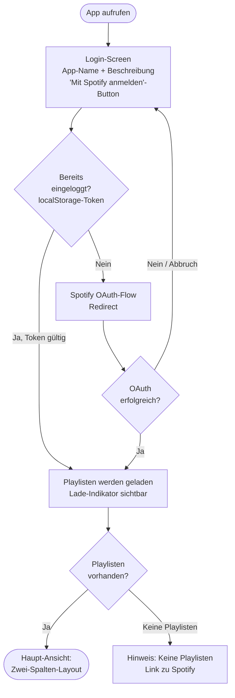
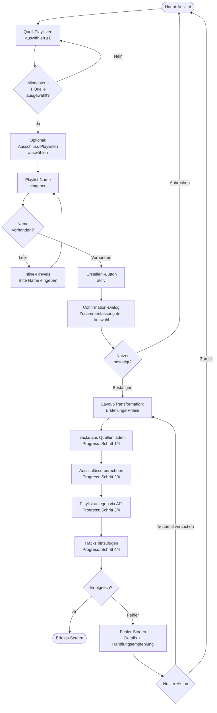
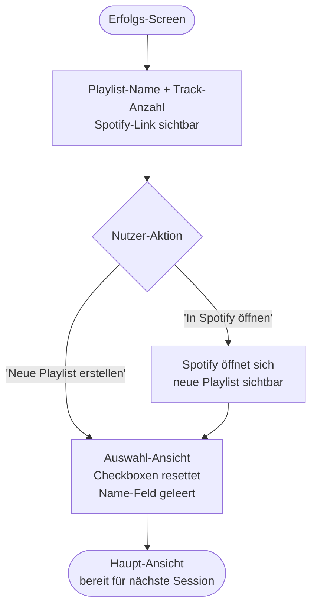

# UX Design Specification — Playlist Cutter

**Author:** Flo
**Date:** 2026-03-20

---

<!-- UX design content will be appended sequentially through collaborative workflow steps -->

## Executive Summary

### Projektvision

Playlist Cutter ist ein fokussiertes Browser-Tool für Spotify-Nutzer, die ihre Playlist-Bibliothek strukturiert kuratieren wollen. Die App führt Differenzmengen-Operationen auf Playlisten durch — vollständig clientseitig, ohne Backend.

Das Produkt soll in seiner Kategorie herausragen durch: eine eigenständige visuelle Identität (kein Spotify-Klon), sorgfältig designte Micro-Interactions und eine Ästhetik, die das Tool trotz seiner Einfachheit premium und durchdacht wirken lässt.

### Zielnutzer

**Primär: Tech-affine Spotify-Kuratoren** (Flo + ähnliche Nutzer)
- Verwalten Playlisten aktiv und strukturiert
- Nutzen das Tool gelegentlich (ca. einmal pro Woche oder seltener)
- Brauchen keine Erklärungen für Konzepte wie "Differenzmenge"
- Desktop-first, moderne Browser
- Schätzen ästhetisches Design — eine schöne App nutzt man lieber

**Nutzungskontext:** Kurze, zielgerichtete Sessions. Der Nutzer weiß, was er will, öffnet das Tool, führt die Operation durch und ist fertig. Kein langer Onboarding-Prozess nötig.

### Visuelle Design-Richtung

**Hell, eigenständig, subtil verspielt.**

Inspiriert von: Linear (Precision-Minimal), Bookwire (Gradient als visueller Faden), Google / inovex (spielerische Animationen auf sauberem Grund).

Konkrete Design-Leitplanken:
- Helles Theme (explizit kein Spotify-Dunkel)
- Ein charakteristischer Farbverlauf zieht sich durch die gesamte UI als Erkennungsmerkmal
- Saubere, moderne Typografie mit Gewicht auf Lesbarkeit
- Micro-Animations als Charakter-Elemente: Checkbox-Auswahl, Progress-Bar, Erfolgsmoment
- Kein Design-Overload — wenige Elemente, jedes bewusst gesetzt

### Key UX Design Challenges

1. **Zwei-Spalten-Checkbox-Layout premium fühlen lassen** — die Kern-Interaktion ist technisch simpel (Checkboxen), muss aber visuell durchdacht wirken
2. **Fortschritts- und Statusmomente gestalten** — Loading, Confirmation-Dialog, Erfolgsmeldung sind keine Afterthoughts, sondern designte Momente
3. **Login-State als starker erster Eindruck** — der leere Zustand vor dem Login ist die erste Seite, die der Nutzer sieht

### Design-Opportunities

1. **Gradient als Signature** — ein Farbverlauf als visueller Faden durch Header, Buttons, Progress-Bar
2. **Animated Selection Feedback** — wenn Playlisten ausgewählt werden, reagiert die UI mit kleinen, angenehmen Animationen (Zähler, Hervorhebung)
3. **Der Erfolgsmoment** — wenn die Playlist erstellt wird, soll das sich gut anfühlen. Eine kleine Animation als Belohnung.
4. **Typografie als Design-Element** — der App-Name / Tagline mit einem typografischen Effekt

## Core User Experience

### Defining Experience

Die Kern-Erfahrung von Playlist Cutter ist die Diff-Konfiguration und -Ausführung: Playlisten auswählen, Ergebnis berechnen lassen, neue Playlist erstellen. Der Nutzer weiß genau, was er tun will — die App soll ihn dabei nicht bremsen, sondern den Prozess klar, schnell und angenehm machen.

### Platform Strategy

- Web App (SPA), Desktop-first, vollständig responsive
- Desktop/Tablet (≥ 768px): Zwei-Spalten-Layout, Mouse + Keyboard
- Mobile (< 768px): Einspaltig gestapelt (Quellen → Ausschlüsse → Toolbar), Touch-optimiert
- Kein Backend, vollständig clientseitig
- Moderne Browser (Chrome, Firefox, Safari, Edge) — Desktop und Mobile
- Sessions-Persistenz via localStorage — kein erneuter Login nach Neuladen

### Effortless Interactions

- **Playlist-Auswahl**: Checkboxen reagieren sofort mit einem visuellen Effekt — interessant aber nicht aufdringlich. Kein Umsortieren der Liste bei Auswahl (verhindert Verklick-Frustration bei langen Listen).
- **Spalten-Farbkodierung**: Quell- und Ausschluss-Spalten erhalten eine subtile farbliche Kodierung — beide gleichwertig im Layout, aber durch Farbe mental unterscheidbar. Sehr zurückhaltend eingesetzt, kein visueller Lärm.
- **Session-Kontinuität**: Nach Seitenneuladen ist der Nutzer direkt eingeloggt, ohne erneuten OAuth-Flow.

### Critical Success Moments

1. **Login → Playlisten erscheinen**: Erster Eindruck nach OAuth. Schnell, klar, die Playlisten sind sofort sichtbar und interagierbar.

2. **Erstellungs-Phase als eigener Zustand**: Nach dem Confirmation-Dialog findet ein bewusster visueller Bruch statt — das Zwei-Spalten-Layout tritt zurück, die App ist klar im "Erstellen-Modus". Fortschrittsbalken steht im Zentrum. Der Nutzer weiß: hier passiert gerade etwas.

3. **Erfolgs-Bestätigung mit Spotify-Link**: Nach erfolgreicher Playlist-Erstellung erscheint ein expliziter Erfolgs-Screen. Der Nutzer sieht die Bestätigung und einen direkten Link zur neu erstellten Playlist in Spotify — mit Spotify-Branding (Logo), eingebettet ins eigene Farbkonzept der App. Erst nach OK-Klick kehrt die App zur Auswahl zurück.

### Experience Principles

1. **Klarheit über jede Phase** — Der Nutzer weiß immer, in welchem Modus er ist: Auswahl, Bestätigung, Erstellung, Erfolg.
2. **Respekt für Aufmerksamkeit** — Animationen und Effekte dienen dem Nutzer — nie als Ablenkung, immer als Orientierung oder Belohnung.
3. **Symmetrie der Entscheidung** — Quellen und Ausschlüsse sind gleichwertige Partner der Diff-Operation; das Design spiegelt das wider.
4. **Der Erfolg gehört dem Nutzer** — Der Erfolgsmoment bekommt seinen eigenen Raum, inklusive direktem Weg zur erstellten Playlist.

### Design-Notizen für spätere Iterationen

- Toggle-Pills als Alternative zu klassischen Checkboxen: Für eine spätere Design-Iteration prüfen (kompakter, besser animierbar).

## Desired Emotional Response

### Primary Emotional Goals

**Primärziel: Kleine Freude** — Playlist Cutter soll sich wie ein kleines Erlebnis anfühlen. Der Nutzer soll nach der Nutzung denken: "Das hat Spaß gemacht." Nicht weil es spektakulär ist, sondern weil alles einfach stimmt — Optik, Ablauf, Feedback.

**Grundlage: Vertrauen und Kontrolle** — Ästhetik ist nie auf Kosten der Bedienbarkeit. Fundamentale UX-Prinzipien haben absolute Priorität. Der Nutzer muss sich jederzeit sicher fühlen, was gerade passiert und was als nächstes kommt.

### Emotional Journey Mapping

| Phase | Gewünschtes Gefühl |
|---|---|
| Erster Aufruf / Login-Screen | Neugier, angenehme Überraschung ("das sieht gut aus") |
| Playlisten erscheinen nach Login | Orientierung, Kontrolle ("ich verstehe sofort was zu tun ist") |
| Playlist-Auswahl | Leichte Freude ("die Interaktion fühlt sich gut an") |
| Confirmation-Dialog | Sicherheit ("ich weiß was ich tue, ich habe alles im Blick") |
| Erstellungs-Phase | Gespannte Erwartung ("es passiert gerade was") |
| Erfolgs-Screen | Befriedigung + kleine Freude ("hat geklappt, schön gemacht") |
| Fehlerfall | Ärger über den Fehler, aber nicht über die App ("klar kommuniziert, ich weiß was tun") |

### Micro-Emotions

- **Vertrauen** über Confusion — jeder Zustand ist eindeutig erklärt
- **Freude** über bloße Satisfaction — der Prozess soll sich leicht gut anfühlen, nicht nur funktionieren
- **Kontrolle** über Anxiety — besonders in der Erstellungs-Phase mit Progress-Feedback
- **Stolz** über Gleichgültigkeit — die neue Playlist ist ein kleines Ergebnis, das der Nutzer geschaffen hat

### Design Implications

- **Freude → Micro-Animations**: Checkbox-Selektion, Progress-Bar, Erfolgs-Screen haben je eine kleine Animation — nie aufdringlich, aber spürbar
- **Vertrauen → Klare Phasen**: Jeder Moduswechsel (Auswahl → Erstellung → Erfolg) ist visuell eindeutig — kein Raten was gerade passiert
- **Kontrolle → Explizites Feedback**: Fortschrittsbalken, Validierungshinweise, Confirmation-Dialog geben dem Nutzer das Gefühl: "Ich entscheide, die App führt aus"
- **Keine Ästhetik über UX**: Animationen dürfen keine Interaktionen verlangsamen oder Informationen verbergen. Schönheit ist Bonus, Bedienbarkeit ist Pflicht.

### Emotional Design Principles

1. **Freude durch Qualität, nicht durch Ablenkung** — ein sauber animierter Fortschrittsbalken erfreut mehr als ein aufwändiger Splash-Screen
2. **Vertrauen durch Klarheit** — der Nutzer fühlt sich wohl, weil er immer weiß wo er steht
3. **Der Erfolgsmoment gehört dem Nutzer** — die App feiert mit, aber dezent — kein Konfetti-Overload, aber ein Moment der Anerkennung
4. **Fehler sind keine Katastrophen** — Fehlermeldungen fühlen sich hilfreich an, nicht beschuldigend

## UX Pattern Analysis & Inspiration

### Inspiring Products Analysis

**Linear** — Precision-Minimal Productivity Tool
- Löst Komplexität durch radikale visuelle Reduktion: viel Whitespace, klare Typografie-Hierarchie, keine unnötigen Dekorationselemente
- Jeder Status ist eindeutig kommuniziert — kein Raten über den aktuellen Zustand
- Keyboard-first, aber auch mit Maus vollständig bedienbar
- Animierte Grid-Hintergrundmuster als subtiles visuelles Charakter-Element

**Tailwind CSS Website** — Tool-Documentation als UX-Vorbild
- Klare, funktionale Struktur die trotzdem visuell ansprechend ist
- Zeigt: gutes Design muss nicht komplex sein — konsequente Konsistenz reicht
- Interaktive Elemente haben klares visuelles Feedback ohne Überladung

**Bookwire** — Gradient als Design-System
- Ein einziger Farbverlauf als roter Faden durch die gesamte UI
- Macht eine inhaltlich simple Seite sofort wiedererkennbar und visuell stark
- Prinzip: eine starke Design-Entscheidung konsequent durchziehen statt viele kleine Entscheidungen

**inovex.design** — Animierte Icons als Charakter-Element
- SVG-Pfad-Animationen: Icons "zeichnen sich" beim Erscheinen — niedrigschwellig delightful, nie ablenkend
- Elektrisches Blau als Akzentfarbe — sparsam eingesetzt, hohe Wirkung
- Zeigt: eine gute Animation-Idee konsequent angewendet reicht als Signature

### Transferable UX Patterns

**Navigation & Struktur:**
- Single-Page ohne Navigation — Playlist Cutter braucht keine Navigation, das ist eine Stärke. Linear-Prinzip: eine Sache, perfekt gemacht.
- Klare visuelle Phasen statt Tabs/Menüs — der Zustand der App ist das "Menü"

**Interaktions-Patterns:**
- **Checkbox mit visuellem State-Feedback** (Linear-Stil): Auswahl triggert sofortigen visuellen Response — Hintergrundfarbe, Checkmark-Animation, Counter-Update
- **Moduswechsel durch Layout-Transformation** (nicht durch Navigation): Die Zwei-Spalten-Ansicht "zieht sich zurück" wenn der Erstellungs-Modus beginnt — kein Page-Reload, kein Tab-Wechsel, sondern eine Animation
- **Fortschrittsbalken mit Gradient-Styling**: Der Progress-Bar ist nicht nur Funktion, sondern Teil des visuellen Systems (Gradient als Signature)

**Visuelle Patterns:**
- **Gradient als System-Element** (Bookwire-Prinzip): Farbverlauf erscheint in Header, primären Buttons, Progress-Bar, Erfolgs-Akzenten — konsistent, nicht überwältigend
- **Subtile Spalten-Farbkodierung**: Quell-Spalte und Ausschluss-Spalte erhalten je einen leichten Farb-Tint — Orientierung ohne visuellen Lärm
- **Typografie als Ankerpunkt**: App-Name / Tagline mit typografischem Effekt (z.B. Gradient-Text, leichte Animation) als erster Eindruck auf dem Login-Screen

### Anti-Patterns to Avoid

- **Dark Patterns bei Validierung**: Fehler-Meldungen nicht als Blocker verstecken — immer inline, erklärt, mit Handlungsempfehlung
- **Animationen die blockieren**: Keine Animation darf eine Interaktion verzögern. Animationen laufen parallel zur Funktion, nie davor.
- **Spotify-Klon-Ästhetik**: Dunkles Theme, grüne Akzente, Spotify-Schriften — bewusst vermieden. Die App hat eine eigene Identität.
- **Überwältigende Erfolgsmeldungen**: Kein Konfetti-Overload. Der Erfolgsmoment ist warm und anerkennend, nicht laut.
- **Zustandslosigkeit**: Jeder Screen muss sofort kommunizieren in welchem Modus sich die App befindet. Kein zweideutiger UI-Zustand.

### Design Inspiration Strategy

**Übernehmen:**
- Linear: Klarheit, Whitespace, eindeutige Zustände
- Bookwire: Ein Gradient konsequent als visueller Faden
- inovex: Kleine SVG/CSS-Animationen als Charakter-Elemente

**Adaptieren:**
- Linear's Moduswechsel-Konzept: Für den Übergang Auswahl → Erstellungs-Phase adaptieren — kein harter Seitenbruch, sondern eine Layout-Transformation
- Aceternity UI-Komponenten: Als Inspirationsquelle für Checkbox-Styling und Card-Layout — nicht 1:1 übernehmen, sondern ins eigene Farbsystem übersetzen

**Vermeiden:**
- Plastiki-Stil Scroll-Animations: Zu verspielt für ein Utility-Tool
- Accenture-Stil vertikale Typografie-Animationen: Zu aufwändig, zu wenig Nutzen für eine single-purpose App

## Design System Foundation

### Design System Choice

**Tailwind CSS + shadcn/ui** auf Basis von **React + Vite**

- Tailwind CSS für das gesamte visuelle Styling-System (Farben, Spacing, Typografie, Animationen)
- shadcn/ui als Komponenten-Bibliothek: liefert zugängliche, vollständig anpassbare Basis-Komponenten (Checkboxen, Dialoge, Progress, Buttons)
- shadcn/ui ist explizit nicht-opinionated über das visuelle Design — die Komponenten-Logik ist vorhanden, das Aussehen gehört uns

### Rationale für die Auswahl

- **Solo-Entwickler, Greenfield**: kein Custom-System-Aufwand nötig; Tailwind gibt volle Kontrolle ohne Overhead
- **Eigenständige visuelle Identität**: Tailwind + shadcn/ui erzwingen keinen Look — Gradient-System, Farbpalette und Animationen sind vollständig selbst definiert
- **Accessibility out of the box**: shadcn/ui basiert auf Radix UI — ARIA, Keyboard-Navigation und Focus-Management sind bereits korrekt implementiert (WCAG AA aus dem PRD)
- **React + Vite**: Schnelles Dev-Tooling, optimaler Build für eine clientseitige SPA ohne Backend

### Implementation Approach

- Design Tokens via Tailwind Config: Farbpalette, Gradient-Definition, Typografie-Skala, Spacing-System zentral definiert
- shadcn/ui Komponenten werden installiert und direkt ins Projekt-eigene Design-System übernommen (kein externer Dependency-Lock-In)
- Animationen: Tailwind Animate + CSS Transitions für Micro-Interactions; ggf. Framer Motion für komplexere Layout-Transformationen (Moduswechsel Auswahl → Erstellungs-Phase)

### Customization Strategy

- **Gradient als Design-Token**: Der charakteristische Farbverlauf wird als wiederverwendbare Tailwind-Utility definiert und in Header, Buttons, Progress-Bar und Erfolgs-Akzenten eingesetzt
- **Spalten-Farbkodierung**: Leichte Tint-Farben für Quell- und Ausschluss-Spalte als Tailwind-Custom-Colors
- **Checkbox-Komponente**: shadcn/ui Checkbox als Basis, mit eigenem Selection-Animation-Layer überlagert
- **Typografie**: Eine moderne Sans-Serif (z.B. Inter oder Geist) via Google Fonts / Fontsource, definiert in Tailwind Config

## 2. Core User Experience

### 2.1 Defining Experience

**"Playlisten selektieren, Differenz berechnen, neue Playlist erstellen."**

Das ist die definierende Interaktion von Playlist Cutter. Vergleichbar mit:
- Spotify: "Spiel jeden Song sofort ab"
- Playlist Cutter: "Erstelle eine saubere Playlist aus dem, was übrig bleibt"

Der Kern-Wert entsteht im Ergebnis: eine duplikatfreie Playlist, die präzise das enthält was der Nutzer will — und nichts, was er ausgeschlossen hat. Das ist die Lücke die Spotify nicht füllt.

### 2.2 User Mental Model

Der Nutzer denkt in **Mengen-Logik**:
- "Ich will alle Tracks aus Playlist A und B, aber ohne die die schon in C sind"
- Dieses Konzept ist vertraut für jeden der je manuell Playlisten verglichen hat
- Die Zwei-Spalten-Metapher (Quellen links | Ausschlüsse rechts) spiegelt diese mentale Logik direkt wider — kein Übersetzungsaufwand

**Aktueller Workaround ohne das Tool:**
- Manuelles Durchgehen von Playlisten, Song für Song vergleichen
- Frustration durch Spotify's fehlende Mengenoperationen
- Das Tool macht in Sekunden was sonst Minuten dauert

### 2.3 Success Criteria

Der Nutzer fühlt sich erfolgreich wenn:
- Die Playlisten-Auswahl sofort klar ist und Spaß macht (keine Verwirrung wo was zu tun ist)
- Die Erstellungs-Phase klar kommuniziert dass "es passiert" (kein eingefrierter UI-Zustand)
- Die neue Playlist tatsächlich das enthält was erwartet — keine Duplikate, keine fehlenden Tracks
- Der Erfolgs-Screen einen Moment der Befriedigung erzeugt

**Tempo-Erwartung**: Der Nutzer erwartet die Erstellung in unter 30 Sekunden für typische Playlist-Größen (parallele API-Calls aus dem PRD).

### 2.4 Novel vs. Established Patterns

**Established patterns — direkt übernehmen:**
- Checkbox-Listen für Mehrfachauswahl: universell bekannt, kein Lernaufwand
- Confirmation-Dialog vor destruktiven/erstellenden Aktionen: etablierter Standard
- Fortschrittsbalken für asynchrone Operationen: klare Erwartung

**Innovative Kombination:**
- Das **Zwei-Spalten-Layout mit zwei verschiedenen Auswahlrollen** (Quelle vs. Ausschluss) ist die eigentliche UX-Innovation — es macht Set-Differenz-Logik sofort intuitiv ohne Erklärung
- Der **Moduswechsel durch Layout-Transformation** (nicht durch Navigation) ist ein modernes Pattern das Orientierung ohne Seitenwechsel gibt

### 2.5 Experience Mechanics

**1. Initiation — Login & Playlisten-Ansicht:**
- Nutzer öffnet App → Login-Screen mit App-Identität (Typografie, Gradient)
- OAuth-Flow → Redirect zurück → Playlisten erscheinen im Zwei-Spalten-Layout
- Kein Onboarding-Overlay nötig — das Layout erklärt sich selbst

**2. Interaktion — Auswahl:**
- Playlisten per Checkbox auswählen (linke Spalte: Quellen, rechte: Ausschlüsse)
- Jede Auswahl triggert visuelle Bestätigung (Animation + Counter-Update)
- Spalten sind subtil farblich kodiert — Quellen und Ausschlüsse mental trennbar
- Playlist-Name eingeben (Eingabefeld oberhalb oder im Footer-Bereich)
- Validierung inline: Warnungen erscheinen kontextuell, blockieren nicht sofort

**3. Feedback — Confirmation & Erstellung:**
- "Erstellen"-Button → Confirmation-Dialog mit Zusammenfassung der Auswahl
- Bestätigung → Layout-Transformation: Zwei-Spalten weichen dem Erstellungs-Modus
- Fortschrittsbalken (mit Gradient-Styling) im Zentrum der Seite
- Timeout-Erkennung nach 10 Sekunden mit hilfreicher Fehlermeldung

**4. Completion — Erfolg:**
- Erfolgs-Screen: Bestätigung + direkter Spotify-Link zur neuen Playlist
- Spotify-Branding-Element (Logo) im eigenen Farbkonzept eingebettet
- OK-Button → Rückkehr zur Auswahl-Ansicht (resettet Checkboxen)

## Visual Design Foundation

### Color System

**Basis-Palette:**
- Background: `#FAFAFA` (Off-White — heller, sauberer Grund)
- Surface: `#FFFFFF` (Cards, Panels)
- Border: `#E5E7EB` (subtile Trenner)
- Text Primary: `#111827`
- Text Secondary: `#6B7280`

**Signature Gradient (der rote Faden):**
- `from-indigo-500 to-violet-500` (#6366F1 → #8B5CF6)
- Angewendet auf: primäre Buttons, Progress-Bar, Header-Akzente, Erfolgs-Screen-Element, Gradient-Text für App-Name
- Als `bg-gradient-to-r` Tailwind-Utility zentral definiert

**Semantische Farben:**
- Primary Action: Indigo (#6366F1)
- Success: Emerald (#10B981)
- Warning: Amber (#F59E0B)
- Error: Rose (#F43F5E)

**Spalten-Farbkodierung (sehr subtil):**
- Quell-Spalte: leichter Indigo-Tint (`bg-indigo-50/50`)
- Ausschluss-Spalte: leichter Rose-Tint (`bg-rose-50/50`)
- Beide kaum wahrnehmbar — nur als mentale Orientierungshilfe

### Typography System

**Primär: Plus Jakarta Sans**
- Charaktervoll aber klar — freundlich ohne verspielt zu sein
- Funktioniert hervorragend für Headings und Interface-Text
- Geladen via Fontsource (`@fontsource/plus-jakarta-sans`)

**Typ-Skala:**
- App-Name / Hero: `text-4xl font-bold` — mit Gradient-Text-Effekt
- Section Headers (Spalten-Titel): `text-lg font-semibold`
- Playlist-Namen: `text-sm font-medium`
- Labels / Meta: `text-xs text-secondary`
- Body / Beschreibungen: `text-sm`

**Ton:** Modern und klar — die Typografie gibt der App Charakter ohne abzulenken. Der Gradient-Effekt auf dem App-Namen ist der einzige typografische "Moment".

### Spacing & Layout Foundation

**Base Unit:** 4px (Tailwind Default)
**Gefühl:** Großzügig — Whitespace als Design-Element (Linear-Prinzip)

**Layout-Struktur:**
- Max-Width: `max-w-6xl` zentriert auf dem Viewport
- Header: fixiert, schlank — App-Name links, User-Info / Logout rechts
- Hauptbereich: Zwei-Spalten-Grid (`grid-cols-2 gap-6`)
- Footer-Bereich: Playlist-Name-Eingabe + "Erstellen"-Button
- Padding: großzügig (`p-6` bis `p-8` für Container)

**Komponenten-Spacing:**
- Playlist-Zeilen: `py-3 px-4` — angenehm klickbar, nicht zu dicht
- Spalten-Header: `pb-3 mb-4 border-b` — klare Trennung
- Buttons: `px-6 py-2.5` — komfortabel, nicht überdimensioniert

### Accessibility Considerations

- Alle Text/Hintergrund-Kombinationen ≥ 4.5:1 Kontrast (WCAG AA)
- Indigo-Gradient auf Weiß: ✅ ausreichend Kontrast bei Schrift auf weißem Hintergrund; Gradient nur für Dekorationselemente
- Spalten-Tints (`indigo-50/50`, `rose-50/50`) sind rein dekorativ — keine Information wird ausschließlich über Farbe kommuniziert
- Focus-States: shadcn/ui Radix-Basis liefert korrekte Focus-Rings
- Fehlermeldungen zusätzlich mit ARIA-Attributen (aus PRD)

### Anmerkung zur Farbrevision

Das Farbsystem ist bewusst als Ausgangspunkt konzipiert. Nach der ersten funktionsfähigen Version der App empfiehlt sich eine Revision im Gesamtkontext — insbesondere die Akzentfarbe und die Spalten-Tints können dann visuell beurteilt und angepasst werden.

## Design Direction Decision

### Design Directions Explored

Erkundet wurden zwei Runden mit insgesamt 14 Variationen:

**Runde 1 — Strukturelle Layouts:** Precision Minimal, Gradient Statement, Card Gallery, Dense Professional, Warm Rounded sowie Mockups der Erstellungs-Phase, des Erfolgs-Screens und des Login-Screens.

**Runde 2 — Akzentfarben (alle auf Basis Dense Professional):** Indigo Sharp, Teal Crisp, Amber Warm, Slate Cool, Violet Playful, Sky Electric.

**Runde 3 — Feintuning (Equal Split + Sky + verschiedene Schriftgrößen):** Interaktive Mockups mit Checkbox-Animation, Row-Highlight, Badge-Bounce und Button-Ripple in drei Schriftgrößen (14px / 15px / 16px).

### Gewählte Richtung

**Equal Split Layout** mit folgenden festgelegten Parametern:

- **Layout:** Zwei gleiche Spalten (Quellen | Ausschlüsse), Toolbar oben mit Playlist-Name-Input und Erstellen-Button
- **Akzentfarbe Quellen:** Sky `#0284C7`
- **Akzentfarbe Ausschlüsse:** Gedämpftes Rose `#C9445A` (bewusst softer als ein hartes Rot, harmoniert mit Sky-Blau)
- **Schriftgröße Playlist-Namen:** 16px, font-weight 500 (ausgewählt: 700)
- **Zeilenhöhe:** ~46px (großzügig, Desktop-optimiert)
- **Playlist-Darstellung:** Nur Text — kein Album-Art, keine Avatare
- **Auswahlmechanik:** Checkboxen (keine Toggle-Switches)
- **Gradient:** Bewusst gestrichen — eine einzige Flat-Akzentfarbe statt Farbverlauf

### Design Rationale

- **Kein Gradient:** Der ursprünglich geplante Indigo→Violet-Gradient wurde gestrichen, da er in Mockups wie simulierte Album-Art wirkte und das Konzept verwässerte. Eine konsequente Flat-Akzentfarbe ist klarer und eigenständiger.
- **Sky Blau statt Indigo/Violet:** Sky `#0284C7` ist kraftvoll und digital ohne Spotify-assoziiert zu wirken. Es schafft eine eigenständige Identität.
- **Gedämpftes Rose für Ausschlüsse:** Hartes Rot (`#DC2626`) passte farblich nicht zu Sky-Blau. Das gedämpfte Rose `#C9445A` kommuniziert weiterhin semantisch "Ausschluss/Entfernen", wirkt aber harmonischer im Gesamtbild.
- **16px Schrift:** Bei einer Desktop-App mit wenig Inhalt wirkt größere Schrift professioneller und angenehmer zu lesen — kein Information-Overload, der kleinere Schrift erzwingen würde.
- **Equal Split:** Alle anderen Layouts (Asymmetric, Vertical Stack, Full-Height Panels, Bridge, Unified List) erhöhten die Komplexität ohne klaren Mehrwert für das simple Zwei-Rollen-Konzept (Quelle vs. Ausschluss).

### Animations & Micro-Interactions (festgelegt)

- **Checkbox-Pop:** Federt bei Auswahl (scale 0.82 → 1.12 → 1.0)
- **Row-Highlight:** Linke Akzent-Border + Hintergrundfarbe wechselt weich beim Auswählen
- **Badge-Bounce:** Ausgewählt-Zähler springt kurz hoch bei Änderung
- **Live Track-Zähler:** Summary-Zeile rechnet Tracks in Echtzeit neu
- **Button-Ripple:** Klick auf "Erstellen" gibt Welleneffekt
- **Button-Hover:** Leichtes Anheben (translateY -1px) mit Schatten

### Icons (festgelegt)

- Quellen-Spalten-Header: `+` Icon auf Sky-Hintergrund
- Ausschlüsse-Spalten-Header: `−` Icon auf Rose-Hintergrund
- Erstellen-Button: `+` Icon
- Logout-Link: Tür/Exit-Icon

### Implementation Approach

- Tailwind CSS für alle Abstände, Farben und Typografie-Skala
- shadcn/ui Checkbox als Basis, mit eigenem Animation-Layer
- CSS Transitions für Row-Highlight und Checkbox-Pop
- JavaScript für Live-Zähler und Badge-Bounce
- Lucide Icons (konsistent mit shadcn/ui-Ökosystem)

## User Journey Flows

### Journey 1: Erster Aufruf & Login



### Journey 2: Playlist-Konfiguration & Erstellung



### Journey 3: Erfolg & Weiternutzung



### Journey Patterns

- **Phasen-Wechsel durch Layout-Transformation** — kein Seitenwechsel, kein Tab; der UI-Zustand selbst kommuniziert die aktuelle Phase (Auswahl / Erstellung / Erfolg / Fehler)
- **Inline-Validierung statt Modal-Blocker** — Name-Pflichtfeld wird nicht als Popup erzwungen, sondern als deaktivierter Button mit kontextuellem Hinweis
- **Immer ein klarer Rückweg** — jeder nicht-erfolgreiche Zustand (Fehler, Abbruch) führt zurück zur Haupt-Ansicht ohne Datenverlust der Auswahl

### Flow Optimization Principles

- **Kein Onboarding nötig** — Column-Header-Icons (`+` / `−`) geben genug Kontext; Layout erklärt sich selbst
- **Timeout-Erkennung** — nach 10s API-Stille aktiv hilfreiche Meldung statt eingefrorener UI (aus PRD)
- **Session-Persistenz** — gültiger OAuth-Token im localStorage überspringt den Login-Screen komplett
- **Ergebnis-Schätzung** — Live Track-Zähler in der Toolbar gibt dem Nutzer bereits vor dem Erstellen eine Orientierung über die Ergebnisgröße

## Component Strategy

### Design System Components

**Direkt verwendbar (shadcn/ui, keine Anpassung nötig):**

| Komponente | Verwendung |
|---|---|
| `Checkbox` | Basis für Playlist-Auswahl (Radix UI, ARIA-korrekt) |
| `Dialog` | Confirmation-Dialog vor dem Erstellen |
| `Progress` | Fortschrittsbalken in der Erstellungs-Phase |
| `Input` | Playlist-Name-Eingabe in der Toolbar |
| `Button` | Erstellen-Button, Spotify-Link, Login-Button |

**Verwendbar mit Styling-Anpassung:**

| Komponente | Anpassung |
|---|---|
| `Badge` | Für "N ausgewählt"-Zähler — Farbe auf Sky/Rose anpassen |
| `Separator` | Spalten-Trennlinie |

### Custom Components

#### PlaylistRow

**Zweck:** Die zentrale Interaktionseinheit — eine Playlist-Zeile mit Checkbox, Name und Track-Anzahl.

**Anatomie:** `[Checkbox] [Playlist-Name] [Track-Anzahl]`

**States:** default · hover · selected-source (Sky) · selected-exclude (Rose)

**Animation:** Checkbox-Pop bei Auswahl (scale 0.82 → 1.12 → 1.0); Row-Hintergrund und linke Border wechseln weich per CSS Transition.

**Props:** `name`, `trackCount`, `role: 'source' | 'exclude'`, `selected`, `onToggle`

**Accessibility:** `role="checkbox"`, `aria-checked`, Space = toggle per Tastatur

#### ColumnHeader

**Zweck:** Spalten-Überschrift mit Icon-Pill, Titel und Live-Badge.

**Anatomie:** `[Icon-Pill (+ oder −)] [Spalten-Titel] [Badge: "N ausgewählt"]`

**Animation:** Badge-Bounce wenn Zahl sich ändert.

**Props:** `role: 'source' | 'exclude'`, `selectedCount`

#### Toolbar

**Zweck:** Fixierte Aktionsleiste — Playlist-Name-Input, Live-Summary, Erstellen-Button.

**Anatomie:** `[Label] [Input: Playlist-Name] [Summary-Text] [Button: Erstellen]`

**States:** Button `disabled` solange kein Name oder keine Quelle; Input fokussiert: Sky-Border; Summary live aktualisiert.

**Props:** `value`, `onChange`, `summary`, `onSubmit`, `disabled`

#### CreationPhase

**Zweck:** Vollbild-Zustand während der Erstellung — ersetzt das Zwei-Spalten-Layout.

**Anatomie:** Titel · Subtitle (Playlist-Name) · Progress-Bar (Sky-Akzent) · Schritt-Liste (4 Schritte: done / active / pending)

**Animation:** Schritte wechseln animiert; aktiver Schritt mit Puls-Dot; Progress-Bar fließend.

#### SuccessScreen

**Zweck:** Erfolgs-Bestätigung nach Playlist-Erstellung.

**Anatomie:** Check-Icon (Sky-Kreis) · Titel · Track-Anzahl · Playlist-Card mit "In Spotify öffnen"-Button (Spotify-Grün) · "Neue Playlist erstellen"-Button

#### ErrorState

**Zweck:** Fehler-Screen mit Ursache und Handlungsempfehlung.

**Anatomie:** Warn-Icon · Titel · Fehlertext · "Nochmal versuchen" · "Zurück zur Auswahl"

**Varianten:** Timeout-Fehler vs. API-Fehler (unterschiedliche Texte, gleiche Struktur)

### Component Implementation Strategy

- Alle Custom Components bauen auf Tailwind-Design-Tokens auf — keine hardcodierten Farben im JSX
- `PlaylistRow` erweitert shadcn/ui `Checkbox` — keine eigene Checkbox-Logik implementieren
- Animationen via Tailwind Animate + CSS Transitions; `CreationPhase` Phasenübergang ggf. Framer Motion
- Alle Komponenten exportieren klare TypeScript-Interfaces

### Implementation Roadmap

**Phase 1 — Kern-Flow:**
1. `AppHeader` — Login-State + User-Info + Logout
2. `PlaylistRow` — Kern-Interaktion
3. `ColumnHeader` — Spalten-Struktur mit Icon und Badge
4. `Toolbar` — Erstellen-Aktion mit Input und Live-Summary

**Phase 2 — Erstellungs-Flow:**
5. `CreationPhase` — Fortschritts-Screen mit Schritt-Liste
6. `SuccessScreen` — Abschluss-Moment mit Spotify-Link
7. `ErrorState` + Timeout-Handling

**Phase 3 — Polish:**
8. Alle Animations-Layer (Checkbox-Pop, Badge-Bounce, Button-Ripple)
9. Login-Screen mit App-Beschreibung
10. Keyboard-Navigation durchgängig testen (WCAG AA)

## UX Consistency Patterns

### Button-Hierarchie

| Ebene | Verwendung | Aussehen |
|---|---|---|
| **Primary** | Erstellen, Login | Sky `#0284C7`, ausgefüllt, Icon links |
| **Secondary** | Abbrechen (im Dialog), "Zurück zur Auswahl" | Outline, Border `#E5E7EB`, neutral |
| **Destructive-Neutral** | Logout | Textlink mit Logout-Icon, Farbe `#9CA3AF` |
| **External** | "In Spotify öffnen" | Spotify-Grün `#1DB954`, eigenständige Farbwelt |

Regeln: Nie mehr als ein Primary-Button sichtbar. Primary-Button deaktiviert (`opacity-50`, `cursor-not-allowed`) wenn Voraussetzungen fehlen — kein Tooltip nötig, der Live-Zähler erklärt den Kontext.

**Mobile:** Alle Buttons bleiben identisch — keine Touch-spezifischen Varianten nötig. Der Primary-Button in der Toolbar hat auf Mobile `w-full` (volle Breite) für einfachere Bedienbarkeit.

### Feedback-Patterns

**Inline-Validierung (Playlist-Name-Input):**
- Kein Blocking-Modal — Button bleibt disabled, Input zeigt Rose-Border wenn ohne Namen submitted wird
- Der deaktivierte Button ist ausreichende Kommunikation — kein Fehlertext unter dem Input nötig

**Lade-Zustand (Playlisten laden nach Login):**
- Skeleton-Rows statt Spinner — Platzhalter in beiden Spalten mit Shimmer-Animation zeigen die erwartete Struktur
- Kein abrupter Wechsel von leer zu Inhalt
- **Mobile:** Skeleton-Rows erscheinen nacheinander (erst Quellen-Spalte, dann Ausschlüsse) — gleiche Ladereihenfolge wie das gestapelte Layout

**Erstellungs-Progress:**
- `CreationPhase`-Komponente übernimmt den vollen Viewport
- 4 explizite Schritte — kein unbestimmter Spinner
- Nach 10s ohne Fortschritt: Timeout-Meldung mit Retry-Option (kein automatischer Retry)

**Fehlermeldungen:**
- Immer: Was ist passiert + Was kann der Nutzer tun
- Nie: technische Fehlercodes im primären Text
- Ton: sachlich, nicht beschuldigend ("Die Verbindung zu Spotify wurde unterbrochen" — nicht "Fehler 503")

### Auswahl-Patterns (Checkboxen)

- **Keine Sortierung bei Auswahl** — ausgewählte Playlisten bleiben an ihrer Position (verhindert Verklick-Frustration)
- **Dieselbe Playlist kann in beiden Spalten erscheinen** — technisch erlaubt, Nutzer-Verantwortung
- **Keine Select-All** — bei Mengenoperationen semantisch falsch
- **Mobile:** Scroll-Verhalten innerhalb jeder Spalte bleibt erhalten — auf Mobile scrollt der Nutzer zuerst durch Quellen, dann durch Ausschlüsse (natürliche vertikale Leserichtung)

### Modal / Overlay-Pattern

Einziger Modal: **Confirmation-Dialog** vor dem Erstellen.

**Inhalt:** Zusammenfassung (X Quellen, Y Ausschlüsse, ~Z Tracks, Playlist-Name)

**Regeln:**
- Zwei Buttons: Primary "Erstellen" + Secondary "Abbrechen"
- Abbrechen schließt Dialog ohne Datenverlust — Auswahl bleibt erhalten
- shadcn/ui `Dialog` (Radix Portal): Escape = Abbrechen, Klick außerhalb = Abbrechen
- Kein Confirmation-Dialog für Logout
- **Mobile:** Dialog erscheint als Bottom Sheet (shadcn/ui `Drawer` statt `Dialog`) — ergonomischer auf Touch-Screens, Daumen-erreichbar

### Empty States

| Zustand | Anzeige |
|---|---|
| Keine Playlisten nach Login | Hinweis + Link zu Spotify |
| Keine Quelle ausgewählt | — (Erstellen-Button disabled genügt) |
| Ergebnis wäre 0 Tracks | Warnung im Live-Zähler: "0 Tracks — alle Tracks würden ausgeschlossen" |

### Responsive Layout-Pattern

**Breakpoint-Strategie:** `md` (768px) als Grenze — Tailwind `md:grid-cols-2`

| Viewport | Layout |
|---|---|
| `< 768px` (Mobile) | Einspaltig, vertikal gestapelt |
| `≥ 768px` (Tablet, Desktop) | Zweispaltig nebeneinander |

**Reihenfolge auf Mobile:**
1. Quellen-Spalte (oben)
2. Ausschlüsse-Spalte (darunter)

Diese Reihenfolge spiegelt die logische Ablauf-Reihenfolge der Operation wider — der Nutzer denkt zuerst "was will ich haben", dann "was soll ausgeschlossen werden".

**Toolbar-Position:**
- **Desktop/Tablet:** Oberhalb der Spalten
- **Mobile:** Unterhalb aller Inhalte — fixierter Footer (`sticky bottom-0`) mit Playlist-Name-Input und Erstellen-Button
- Dieser Positionswechsel folgt dem logischen Flow auf Mobile: Erst Quellen auswählen → Ausschlüsse auswählen → dann unten abschließen

**Schematische Darstellung:**

```
Desktop/Tablet:          Mobile:
┌─────────────────┐      ┌────────────────┐
│    Toolbar      │      │  Quellen       │
├────────┬────────┤      │  [Playlist 1]  │
│Quellen │Ausschl.│      │  [Playlist 2]  │
│[P1]    │[P3]   │      ├────────────────┤
│[P2]    │[P4]   │      │  Ausschlüsse   │
└────────┴────────┘      │  [Playlist 3]  │
                         ├────────────────┤
                         │ sticky Toolbar │
                         └────────────────┘
```

**Implementierung:** Tailwind Responsive-Klassen — keine JavaScript-basierte Layout-Logik nötig. `grid grid-cols-1 md:grid-cols-2` für die Spalten; `sticky bottom-0` für die Toolbar auf Mobile, `static` (default) auf Desktop.

### Konsistenz-Regeln

1. **Phasen-Wechsel immer durch Layout-Transformation** — niemals URL-Wechsel oder Tab-Navigation
2. **Jeder Zustand ist eindeutig** — Auswahl, Bestätigung, Erstellung, Erfolg, Fehler existieren nie gleichzeitig
3. **Animationen blockieren nie** — alle Transitions laufen parallel zur Funktion, nie davor
4. **Farbe kommuniziert Rolle, nicht Status** — Sky = Quelle, Rose = Ausschluss; kein Grün/Rot für OK/Fehler in den Spalten
5. **Responsive ohne Funktionsverlust** — alle Features sind auf Mobile vollständig nutzbar; nur das Layout passt sich an, nie die Logik
